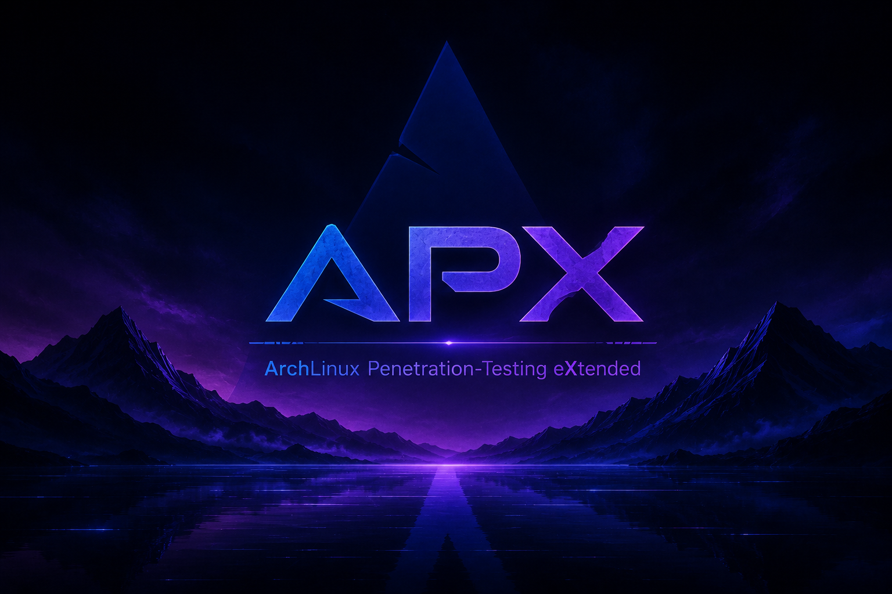
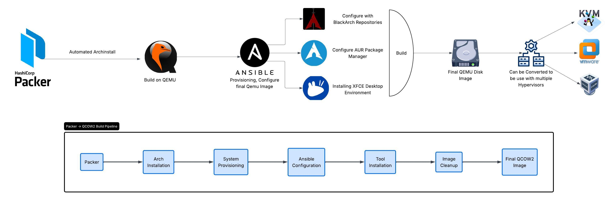

# APX - ArchLinux Penetration-Testing eXtended

APX is a minimal, performance-focused Arch Linux distribution tailored for penetration testing, offensive security workflows, and advanced research environments.

Built on top of Arch Linux with automation-first principles, APX aims to provide a reproducible, lightweight, and customizable security workstation optimized for virtualized environments.



---

## Features

* Minimal and clean XFCE desktop environment
* Lightweight design optimized for long working sessions
* Arch Linux rolling-release base
* BlackArch repository integration
* Automated image builds using Packer
* Infrastructure-as-Code provisioning with Ansible
* Virtual machine optimized (QEMU/KVM)
* Modern Unix commands and tools
* Offensive security and research focused tooling
* Reproducible builds and deployment pipeline

---

## Project Goals

APX is designed to provide:

* A stable penetration testing environment
* Fast deployment inside virtual machines
* Reproducible infrastructure and configurations
* Minimal resource consumption
* Long-term maintainability
* Flexible customization for researchers and red teams

Unlike traditional penetration testing distributions, APX focuses on simplicity, automation, and transparency rather than shipping thousands of preinstalled tools by default.

---

## Tech Stack

| Component             | Technology      |
| --------------------- | --------------- |
| Base Distribution     | Arch Linux      |
| Desktop Environment   | XFCE            |
| Build Automation      | Packer          |
| Provisioning          | Ansible         |
| Virtualization        | QEMU/KVM        |
| Filesystem            | EXT4            |
| Bootloader            | GRUB            |
| Repository Extensions | BlackArch + AUR |

---

## Build Pipeline

The APX build process is fully automated:



---

## Current Status

APX is currently under active development.

Development To-Do list:

* Support for (VMWare - VBox)
* Support build on (Fedora , Arch)
* Cleanup process (Remove packer user and create an already identified user)

---

## Requirements

Recommended host environment:

* Linux host system
* QEMU/KVM support
* Hardware virtualization enabled
* Minimum 4 CPU cores
* Minimum 8 GB RAM
* At least 40 GB free disk space

---

## Building APX

- Add your user and encrypted password in `APX-Playbook/group_vars/all.yml` that you will be use in APX system

```yml
deploy_user: testuser
deploy_user_password: $6$4oSPJWAgahz42lRi$mXty2Bt4xtaPrjnwDLoOjLUa0sXzqNJy2tLRXEV./3khISzATiG2CSPApJ.dTUwB63WMaybdH59EPWngLt0z3.
```

- Add the root encrypted password in `http/user_credentials.json` file, The current password: **change_me_later** 

```json
"root_enc_password": "$y$j9T$wnI9CIQjL6tWJBRgbfTVq/$SeheIrt4tVATRm2ttiNXqT5aIdylPUOAlQzBncHrfn1"
```

> Don't modify the encrypted password of packer user as this is the user used by packer and ansible, It's recommended to completly remove the user packer later.

- Use `Initiate_APX_Build.sh` script to start your build


```bash
sudo ./Initiate_APX_Build.sh -h

---
Usage: Initiate_APX_Build.sh [OPTIONS]

Options:
  -u, --user <username>          Specify your current host username (Required)
  -v, --hypervisor <hypervisor>  Specify the hypervisor you will use (kvm,vbox,vmware)
  -s, --disk-size <SIZE_GB>      Specify the disk size of the generated image in GB (EX: 10)
  -h, --help                     Display this help menu and exit
---
# Example command
sudo ./Initiate_APX_Build.sh -u <Current_Host_User> -v kvm -s 25
```

---

## Disclaimer

APX is intended for:

* authorized penetration testing
* security research
* malware analysis
* educational purposes
* lab environments

Users are responsible for complying with local laws and regulations.

---

## License

MIT License
